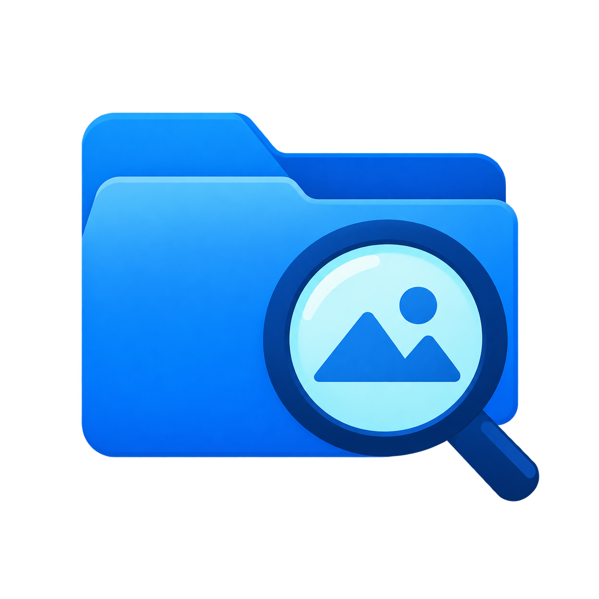

<p align="center"></p>

# FolderLens

Windows 原生文件浏览器。选择顶层文件夹，穿透子目录汇总浏览各类文件，保留原来的文件结构。图片和视频浏览是重点增强功能。

当前为开发中的源码版本。图片和文件浏览是本轮重点；完整一期验收尚未完成，不提供“已完成全部一期功能”的保证。实际检查与剩余验证范围见 [验证记录](docs/verification.md)。

## 浏览功能

- 递归穿透目录；缩略图网格、详细列表、相对路径、目录树、返回/前进和上一级。
- 缩略图和详情列表支持在当前视口拖动框选；Ctrl/Shift 追加选择，Esc 取消本次框选。
- 按媒体类型、格式、尺寸、体积等筛选；显示正在生效的高级筛选。
- 文本文件、PDF、Word 文档、Excel 表格、PPT 演示文稿和压缩文件分类；文档及全部文件默认使用详细信息列表，可手动切换网格。
- “筛选 → 更多条件与目录排除”中的文件夹筛选，支持名称、相对路径、正则、排除与例外保留；可预览、停用规则，并随“收藏 → 保存当前视图”保存。
- TXT 默认自动换行；Markdown 支持排版阅读。放大阅读时用“返回文件列表”保留目录和原来的浏览位置。
- 按文件夹分组，支持全部层级或仅下一级；分别设置文件夹与组内文件排序。
- 图片适屏、实际像素、缩放、平移、只读旋转、全屏和连续切换。
- 按住左键默认临时放大至 **250%**；大视图默认放大全图，小预览默认局部放大；倍率与模式可设置。
- 相邻图片预取；可见缩略图按需加载；扫描结果增量进入列表，保留未变化的容器和缩略图。
- 视频选中后显示封面，点击预览区“播放”即可内置播放、暂停和拖动定位。列表双击默认使用外部播放器，可在“视频播放器”设置中改为内置播放；也可按当前浏览顺序生成外部播放列表。内置播放支持系统解码器可读取的格式，不支持时可使用外部播放。

缩略图和详情列表支持多选复制、剪切、粘贴、移动、删除，以及单文件重命名。文件操作交给 Windows Shell，冲突由系统提示处理，删除使用回收站流程。支持与资源管理器交换文件拖放；拖入默认同盘移动、跨盘复制，Ctrl 强制复制、Shift 强制移动。浏览和预览不会改写原文件，不提供图片编辑或格式转换。收藏保存原文件位置：复制或新增文件不会改变收藏，原位置改名或消失后移除对应收藏，不追踪新位置。文件列表重新扫描，缩略图缓存有容量上限与过期清理。左侧目录与预览之间的分隔条可以上下拖动，双击恢复默认比例。

PDF、Office 和压缩文件目前支持分类、列表、文件属性和外部打开；尚不提供其内部内容预览或压缩包穿透。文件夹规则说明见[使用说明](docs/DIRECTORY_FILTERING_PROPOSAL.md)，后续文件查找能力见[一期调整](docs/FILE_BROWSER_PHASE_ONE.md)。

## 开发与运行

目标：Windows x64。开发基线为 .NET SDK 10.0.401、WinUI 3 / Windows App SDK、Win2D、SQLite。NuGet 版本由 `Directory.Packages.props` 和各项目的 `packages.lock.json` 固定。

1. 安装带 C++ 桌面开发工具和 Windows SDK 的 Visual Studio Build Tools，以及 CMake。
2. 按 [native/dependency-lock.json](native/dependency-lock.json) 准备对应的 .NET、LibRaw 和 WebView2 归档。该文件列出来源、版本、目标位置和 SHA-256；将归档放到其中 `archive` 指定的项目内路径。
3. 准备同一文件记录的 FFmpeg / FFprobe、VC 运行库输入。第三方二进制不随本源码仓库上传；版本和分发限制见依赖记录及 `native/ffmpeg/LICENSE.txt`。
4. 在仓库根目录使用 PowerShell 运行：

```powershell
.\scripts\Bootstrap.ps1
.\scripts\Build.ps1 -Configuration Release
```

`Bootstrap.ps1` 验证并解压已准备的本地归档，不会自动安装系统软件。构建缺少依赖时会报出具体路径；请根据依赖记录补齐。

CMake 优先从 `PATH` 查找，其次从 Visual Studio 安装位置查找，不要求 Community 版固定路径。非默认安装可在当前 PowerShell 会话设置 `$env:FOLDERLENS_CMAKE`（cmake.exe 路径）、`$env:FOLDERLENS_VS_ROOT`（Visual Studio 根目录）或 `$env:FOLDERLENS_CRT_DIR`（VC 运行库 DLL 所在目录）。运行库仍须与依赖锁定文件的版本和全部 SHA-256 一致；指定其他路径不会跳过校验。

已有交付目录时，使用同一个入口运行：

```powershell
.\scripts\Run-Local.ps1
```

脚本读取 `artifacts/publish/latest-candidate.json`，不会回退启动另一份 `bin` 程序。首次从源码构建的开发者可显式传入 `-AppRoot` 指向构建目录。

程序可接受 `--root <目录>` 或 `--open <文件>`。默认应用数据位于 `%LOCALAPPDATA%\FolderLens`；便携模式位于程序旁的 `data`；`--data-dir <本地目录>` 可用于隔离验证数据。

索引是扫描所选目录后生成的本地文件目录数据库，保存文件路径、大小、时间等信息，用于浏览和筛选；它不是训练数据。每位用户生成自己的索引，程序不自动上传索引或源文件。分发包不应包含使用后生成的索引、收藏、配置及缓存；不要直接把自己使用过的程序目录压缩后分享。

## 验证

```powershell
. .\scripts\Common.ps1
$dotnet = Get-DotNet
& $dotnet test tests\FolderLens.UnitTests\FolderLens.UnitTests.csproj -c Release --no-restore
```

部分测试需要已构建的工作进程、FFmpeg 或实际样本；未准备环境时不应把失败或未运行当作通过。

扫描刷新原生回归验证使用真实 WinUI 控件，会创建窗口。离屏位置不保证不影响任务栏或其他应用的输入，应在专用测试桌面执行，仅写入指定验证目录：

```powershell
.\src\FolderLens.App\bin\Release\net10.0-windows10.0.26100.0\win-x64\FolderLens.App.exe --verify-refresh --data-dir .\artifacts\native-refresh-check
```

结果保存在该目录的 `native-refresh.json`。使用一个新的验证目录运行，避免把旧测试数据当作新一轮输入。这项检查覆盖列表刷新与容器稳定性，不代替真实大目录滚动、鼠标手感、多屏和离线场景验收。

外部源码审计和修复记录：[首轮](docs/audit-2026-09-13.md)、[第二轮](docs/audit-second-2026-09-13.md)、[第三轮及剩余限制](docs/audit-third-2026-09-13.md)。

## 源码结构

| 目录 | 职责 |
|---|---|
| `src/FolderLens.App` | WinUI 窗口、虚拟列表、图片交互 |
| `src/FolderLens.Core` | 筛选、排序、导航与调度模型 |
| `src/FolderLens.Infrastructure` | SQLite 索引、目录扫描、缓存、媒体接口 |
| `src/FolderLens.Media.Worker` | 隔离的图片解码工作进程 |
| `src/FolderLens.Scan.Worker` | 隔离的文件系统读取 |
| `src/FolderLens.Content.Worker` | 文本和 Markdown 工作进程 |
| `contracts` | 数据库和进程通信契约 |
| `tests` | 回归测试 |
| `docs`、`planning` | 产品规范和验收基线 |

Logo 原始图形通过图像生成工具制作，应用图标由 `scripts/Build-AppIcon.ps1` 从 PNG 生成多尺寸 ICO。第三方组件的许可证各自适用；当前仓库未另行授予项目整体的开源许可证。
